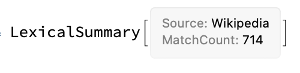

# LexicalSummary

A LexicalSummary object holds the match results and provides access to the data via properties.

Properties:
* Data — Return results as a list of associations
* Dataset — Return results as a Dataset
* Counts — A Dataset of counts for each match
* TotalMatchCount — The total number of matches found
* MatchCounts — A Dataset of counts for each match excluding Missings
* CountGroups — Group matches by their count
* MatchCountGroups — Group matches by their count excluding Missings
* PercentDataset — A Dataset of count groups and their percentage of occurrence
* PartOfSpeechGroups — A Dataset of unique words from matches grouped by their part-of-speech classes
* WordStemCountGroups — A Dataset of word stems from unique words in matches grouped by their count
* Source — A string indicating the source of the matches ("Text", "Wikipedia", etc...)
* TextElementStructure — Visualize a LexicalPattern via TextElements
* Survey — A Dashboard showing the PercentDataset, PartOfSpeechGroups, and WordStemCountGroups
