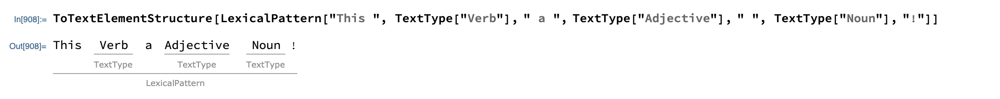
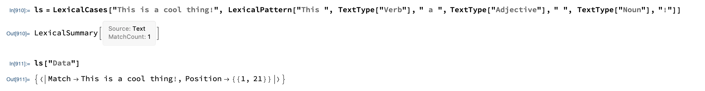
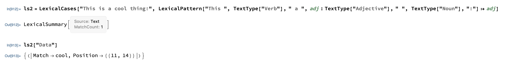

# LexicalCases

## Introduction

About a year ago I started working on functionality that lead to this package. I had to find cases of adjectives preceding words or phrases for a task at work, and thought it would be great to search wikipedia, gather data and do some analysis. The Wolfram Language has functions built in, like [TextCases](https://reference.wolfram.com/language/ref/TextCases.html) for example, but the solution I came up with took too long, and it just wasn't flexible enough. Early iterations of the [LexicalCases](./LexicalCases.md) functionality had patterns structured in a list, and since I only cared about adjectives coming before words, the order was fixed: `{"Adjective", "dogs"}`. I soon realized I may want a more flexible specification, and that's what this project hopes to offer.


## Installation

After cloning the repo or downloading the individual files, load the definitions using `Get`:

```Mathematica
Get["path/to/LexicalCases.wl"]
Get["path/to/LexicalCasesTests.wl"]
```


---
A [LexicalPattern](./LexicalPattern.md) is a string pattern whose elements include text content types (those listed [here](https://reference.wolfram.com/language/guide/TextContentTypes.html)). [LexicalCases](./LexicalCases.md) searches for these patterns in strings. The result is a [summary](./LexicalSummary.md) object which supports several properties (see the doc or use the summary object's `"Properties"` subvalue for a listing).

## Examples
#### A pattern representing the structure "This :Verb: a :Adjective: :Noun:!"

```Mathematica
LexicalPattern["This ", TextType["Verb"], " a ", TextType["Adjective"], " ", TextType["Noun"], "!"]
```
---
#### Visualize a LexicalPattern's structure



```Mathematica
ToTextElementStructure[LexicalPattern["This ", TextType["Verb"], " a ", TextType["Adjective"], " ", TextType["Noun"], "!"]]
```
---
#### Find cases of the pattern in a string



```Mathematica
LexicalCases["This is really cool!", LexicalPattern["This is ", TextType["Adverb"], " ", TextType["Adjective"],"!"]]
```
---
#### Use replacement rules to extract pieces of the pattern



```Mathematica
LexicalCases["This is a cool thing!", LexicalPattern["This ", TextType["Verb"], " a ", adj : TextType["Adjective"], " ", TextType["Noun"], "!"] :> adj]
```

---
## Resources

For more information see the following:
* [LexicalCases](./LexicalCases.md)
* [LexicalPattern](./LexicalPattern.md)
* [LexicalSummary](./LexicalSummary.md)
* [TextType](./TextType.md)

Related Wolfram Language Documentation:
* [TextCases](https://reference.wolfram.com/language/ref/TextCases.html)
* [TextContents](https://reference.wolfram.com/language/ref/TextContents.html)
* [TextContentTypes](https://reference.wolfram.com/language/guide/TextContentTypes.html)
